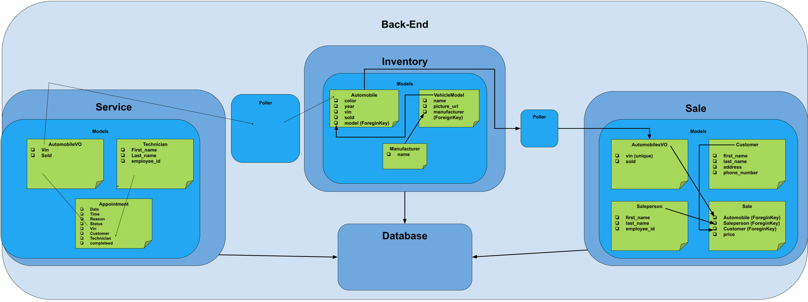

# Dealership
Dealership is a application for a car dealership to manage all entities of a car dealership Sales, Service, and Inventory.


## How to Run this App
**Ensure that you have Docker, Git, and Node.js 18.2 or above**
1. Fork the repository.
2. Clone the repository on your local machine.
3. Build and run the project using Docker with these commands
    docker volume create beta-data
    docker-compose build
    docker-compose up
-View the project in your browser:
    http://localhost:5173

![Img]

## Design
Dealership entails 3 microservices Inventory, Services and Sales. They all interact with each other by use of a poller.

## Diagram



## Integration
Dealership thrives on teamwork! Here's how our domains work together:
Inventory Domain: Maintains records for all wehicles available for sale. This data is shared between Sales and Service domains via a poller, ensuring that Sales and Service teams have up-to-date information.
Sales Domain: Tracks vehicle sales depending on if the vehicle is already listed in the inventory. In-order to create a sale, the sales domain allows for the creation of sales-people and customers. With vehicle data pulled in from Inventory, the sales domain is able to record sales and share this data with the Service domain to manage customer perks.
Service Domain: Uses inventory and sales data to schedule appointments, check VIP status, and maintain service history for each vehicle.

## URLs and Ports to send and view data with insomnia or your browser.

### Manufacturers:
| List Manufacturers | GET |
http://localhost:8100/api/manufacturers/
| Create Manufacturer | POST |
http://localhost:8100/api/manufacturers/
| Get Details of Manufacturer| Get |
http://localhost:8100/api/manufacturers/:id/
| Update a Manufacturer | PUT |
http://localhost:8100/api/manufacturers/:id/
| Delete a Manufacturer | DELETE |
http://localhost:8100/api/manufacturers/:id/

JSON body to send data:

Create / Update Manufacturer : Note you can not make duplicates:
```
{
	"name": "Tesla"
}
```
The Return value expected when creating, updating, and viewing a single Manufacturer:
```
{
	"href": "/api/manufacturers/6/",
	"id": 6,
	"name": "Tesla"
}
```
List Manufacturers expected return value:
```
{
	"href": "/api/manufacturers/2/",
	"id": 2,
	"name": "Toyota"
}
```

### Vehicle Models:
| List vehicle models | GET |
http://localhost:8100/api/models/
| Create a vehicle model | POST |
http://localhost:8100/api/models/
| Get a specific vehicle model | GET |
http://localhost:8100/api/models/:id/
| Update a specific vehicle model | PUT |
http://localhost:8100/api/models/:id/
| Delete a specific vehicle model | DELETE |
http://localhost:8100/api/models/:id/

If you would like to get a list of the vehicle models you get a return of an object with the key value "models":
```
{
	"models" : [
		{
			"href": "/api/models/1/",
			"id": 1,
			"name" : "Sebring",
			"picture_url: "https://platform.cstatic-images.com/xlarge/in/v2/stock_photos/828a5acb-2c3a-4174-8a93-87e9555d8d8d/a36f610b-46c2-49c0-be27-50b672ff3346.png",
			"manufacturer_id" : {
				"href":"/api/manufactureres/1/",
				"id": 1,
				"name": "Daimler-Chrysler"
			}
		}
	]
}
```

If you would like to create vehicle model, it requires:
	-model name
	-URL of an image
	-an id of the manufacturer
```
{
	"name" : "Sebring",
	"picture_url: "https://platform.cstatic-images.com/xlarge/in/v2/stock_photos/828a5acb-2c3a-4174-8a93-87e9555d8d8d/a36f610b-46c2-49c0-be27-50b672ff3346.png",
	"manufacturer_id" : 1
}
```

If you would like to get the detail of a vehicle model, using the vehicles id returns the following:
	*This is also the return value from creating or updating a vehicle model*
```
{
	"href": "/api/models/1/",
	"id": 1,
	"name" : "Sebring",
	"picture_url: "https://platform.cstatic-images.com/xlarge/in/v2/stock_photos/828a5acb-2c3a-4174-8a93-87e9555d8d8d/a36f610b-46c2-49c0-be27-50b672ff3346.png",
	"manufacturer_id" : {
		"href":"/api/manufactureres/1/",
		"id": 1,
		"name": "Daimler-Chrysler"
	}
}
```

If you would like to update a vehicle model it requires:
	-vehicle id in the url
	-model name
	-URL of an image
It is not possible to update the vehicles manufacturer
```
{
	"name" : "Sebring",
	"picture_url: "https://platform.cstatic-images.com/xlarge/in/v2/stock_photos/828a5acb-2c3a-4174-8a93-87e9555d8d8d/a36f610b-46c2-49c0-be27-50b672ff3346.png",
}
```

### Automobiles:
| List Automobiles | GET |
http://localhost:8100/api/automobiles/
| Create Automobile | CREATE |
http://localhost:8100/api/automobiles/
| Get a specific Automobile | GET |
http://localhost:8100/api/automobiles/:vin/
| Update a Automobile | PUT |
http://localhost:8100/api/automobiles/:vin/
| Delete a Automobile | DELETE |
http://localhost:8100/api/automobiles/:vin/

JSON body to send data:

Create Automobile :
```
{
    "color": "Red",
    "year": 2023,
    "vin": "1HGCM82633A123456",
    "model_id": 5
}
```
Update Automobile :
```
{
  "color": "red",
  "year": 2012,
  "sold": true
}
```
Return for creating or updating Automobile :
```
{
	"href": "/api/automobiles/1234567X912435678/",
	"id": 1,
	"color": "Yellow",
	"year": 2003,
	"vin": "1234567X912435678",
	"model": {
		"href": "/api/models/1/",
		"id": 1,
		"name": "Sierra",
		"picture_url": "https://www.chevrolet.com/content/dam/chevrolet/na/us/english/index/vehicles/2025/trucks/silverado-ld/mov/02-images/zr2/2025-ldretail-zr2-01-v03.jpg?imwidth=960",
		"manufacturer": {
			"href": "/api/manufacturers/5/",
			"id": 5,
			"name": "Chevrolet"
			}
		},
		"sold": false
}
```

Return for Getting the details of a specific Automobile by Vin:
Example URL: http://localhost:8100/api/automobiles/specificVin/

```
{
	"href": "/api/automobiles/1234567X912435678/",
	"id": 1,
	"color": "Yellow",
	"year": 2003,
	"vin": "1234567X912435678",
	"model": {
		"href": "/api/models/1/",
		"id": 1,
		"name": "Sierra",
		"picture_url": "https://www.chevrolet.com/content/dam/chevrolet/na/us/english/index/vehicles/2025/trucks/silverado-ld/mov/02-images/zr2/2025-ldretail-zr2-01-v03.jpg?imwidth=960",
		"manufacturer": {
			"href": "/api/manufacturers/5/",
			"id": 5,
			"name": "Chevrolet"
		}
	},
	"sold": false
}
```

Return for List of Automobiles
```
{
	"autos": [
		{
			"href": "/api/automobiles/1234567X912435678/",
			"id": 1,
			"color": "Yellow",
			"year": 2003,
			"vin": "1234567X912435678",
			"model": {
				"href": "/api/models/1/",
				"id": 1,
				"name": "Sierra",
				"picture_url": "https://www.chevrolet.com/content/dam/chevrolet/na/us/english/index/vehicles/2025/trucks/silverado-ld/mov/02-images/zr2/2025-ldretail-zr2-01-v03.jpg?imwidth=960",
				"manufacturer": {
					"href": "/api/manufacturers/5/",
					"id": 5,
					"name": "Chevrolet"
				}
			},
			"sold": false
		}
	]
}
```
# Sales Microservice

The Sales model has 4 key models which include : AutomobileVO, Customer, SalesPerson, and Sale. Sale is interlinked with the other three as each data point in Sale requires an existing Automobile, Customer, and Salesperson.

AutomobileVO is special in that it is a value object that pulls data from the automobiles stored in the inventory using a poller that pings for data every 60 seconds to keep the most current records of automobiles.

With the importance of pulling all the unsold car data from inventory, the Sales Microservice also makes sure to interact with the inventory data to update the cars sold status when ever a sale is made.

### Customers:
Action:						Method:	URL:
List customers 				GET 	http://localhost:8090/api/customers/
Create a customer 			POST 	http://localhost:8090/api/customers/
Delete a specific customer 	DELETE 	http://localhost:8090/api/customers/:id/

When getting the list of customers, an object with a key "customers" is returned that contains all recorded customers:
	-This is the format of the return when creating a customer as well.
```
	{
	"customers": [
		{
			"id": 1,
			"first_name": "Eric",
			"last_name": "Martin",
			"address": "323 Retta Corner Abagailhaven, DE 14354-9841",
			"phone_number": "0987654321"
		}
	]
}
```

When creating a new customer, 4 fields must be passed in the body of the request in order for a succesful creation:
-"first_name"
-"last_name"
-"address"
-"phone_number" (limited to 10 digits)
```
{
	"first_name": "David",
	"last_name": "Iukuridze",
	"address": "12345 Street Str",
	"phone_number": "1234567890"
}
```

In order to delete a customer, the id of the customer must be passed into the url.
	http://localhost:8090/api/customers/1/


### Salespeople:
Action:							Method:	URL:
List salespeople 				GET 	http://localhost:8090/api/salespeople/
Create a salesperson 			POST 	http://localhost:8090/api/salespeople/
Delete a specific salesperson 	DELETE 	http://localhost:8090/api/salespeople/:id/

When getting a list of all the salespeople, an object is returned with a key value "salespeople" :
```
{
	"salespeople": [
		{
			"id": 1,
			"first_name": "Brian",
			"last_name": "Brown",
			"employee_id": "bbrown"
		},
		{
			"id": 2,
			"first_name": "David",
			"last_name": "Iukuridze",
			"employee_id": "diukuridze"
		}
	]
}
```

When creating a new salesperson, 3 fields must be passed in the body of the request in order for a succesful creation:
-"first_name"
-"last_name"
-"employee_id"
```
{
	"first_name": "David",
	"last_name": "Iukuridze",
	"employee_id": "diukuridze",
}
```

In order to delete a salesperson, the id of the salesperson must be passed into the url.
	http://localhost:8090/api/salespeople/1/


### Salesrecords:
Action:			Method:	URL:
List sales 		GET 	http://localhost:8090/api/sales/
Create a sale 	POST 	http://localhost:8090/api/sales/
Delete a sale 	DELETE 	http://localhost:8090/api/sales/:id

When getting a list of all the sales, an object is returned with a key value "sales":
```
{
	"sales": [
		{
			"id": 1,
			"automobile": {
				"vin": "1C3CC5FB2AN120174",
				"sold": false
			},
			"salesperson": {
				"id": 1,
				"first_name": "Test",
				"last_name": "Test",
				"employee_id": "ttest"
			},
			"customer": {
				"id": 1,
				"first_name": "Test",
				"last_name": "Test",
				"address": "12345 Test",
				"phone_number": "1111111111"
			},
			"price": 69999.99
		}
	]
}
```

When creating a new sale, 4 fields must be passed in the body of the request in order for a succesful creation:
-"automobile" - this is the vin of the automobile
-"salesperson" - the id of the salesperson
-"customer" - the id of the customer
-"price"
```
{
	"automobile" : "1C3CC5FB2AN120174",
	"salesperson" : 1,
	"customer" : 1,
	"price": 69999.99
}
```

In order to delete a sale, the id of the sale must be passed into the url.
	http://localhost:8090/api/sales/1/


# Service Microservice
The Service Microservice is designed to enhance customer satisfaction by providing vehicle service history and status. It seemlessly integrates with other CarCar domains to track vehicle history and maintain service records.
Features of the Service Microservice:
-VIP Program: Customers who purchase a vehicle from us automaticallybecome VIPs. Enjoying free oil change for life, complimentary neck massages, and unlimited free car washes.
-Service Appointments: Customers can schedule service appointments with ease.

### Technicians:
| List technicians | GET |
http://localhost:8080/api/technicians/
|Create Technician | POST |
http://localhost:8080/api/technicians/
|Delete Technician | DELETE |
http://localhost:8080/api/technicians/id/

JSON body to send data:
Create a Technician:
```
{
	"first_name": "Jane",
	"last_name": "Doe",
	"employee_id": "12967"
}
```
Response when Getting a List of Technicians:
```
{
	"technician": [
		{
			"first_name": "Jane",
			"last_name": "Doe",
			"employee_id": "1234235",
			"id": 1
		}
	]
}
```

### Service Appointments:
| List Appointments | GET |
http://localhost:8080/api/appointments/
| Create Appointment | POST |
http://localhost:8080/api/appointments/
| Delete Appointment | DELETE |
http://localhost:8080/api/technicians/id/
| Update Status finished | PUT |
http://localhost:8080/api/appointments/3/finish/
| Update Status canceled | PUT |
http://localhost:8080/api/appointments/3/cancel/

JSON body to send data:

Create Appointment:
```
{
	"date": "2024-12-12",
	"time": "14:30",
  "reason": "Routine maintenance",
  "status": "scheduled",
  "vin": "1HGCM82633A123456",
  "customer": "Jane Smith",
  "technician": 3

}
```
Set status to finished or canceled:
```
{
  "status": "finished"
}
```
Return response Apoointments List:
```
{
	"appointments": [
		{
			"id": 2,
			"date": "2024-12-12",
			"time": "09:00:00",
			"reason": "Routine maintenance",
			"status": "scheduled",
			"vin": "1HGCM82633A123456",
			"customer": "Jane Smith",
			"technician": {
				"first_name": "Sara",
				"last_name": "Villa",
				"employee_id": "1234235",
				"id": 1
			},
			"is_vip": false
		}
	]
}
```
